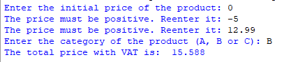

## Description 
This program prompts the user to enter the initial price of a product (excluding tax) and its category, which can be "A" (7% VAT), "B" (20% VAT), or "C" (25% VAT). And it applies the appropriate VAT rate to calculate the total price with VAT and displays the result.
## Example

